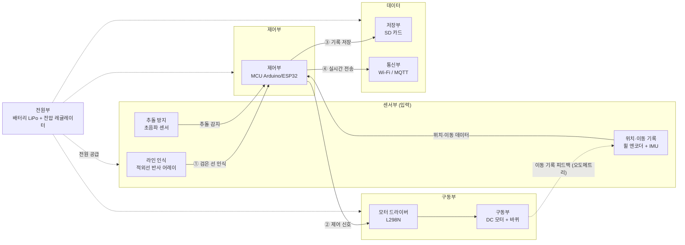
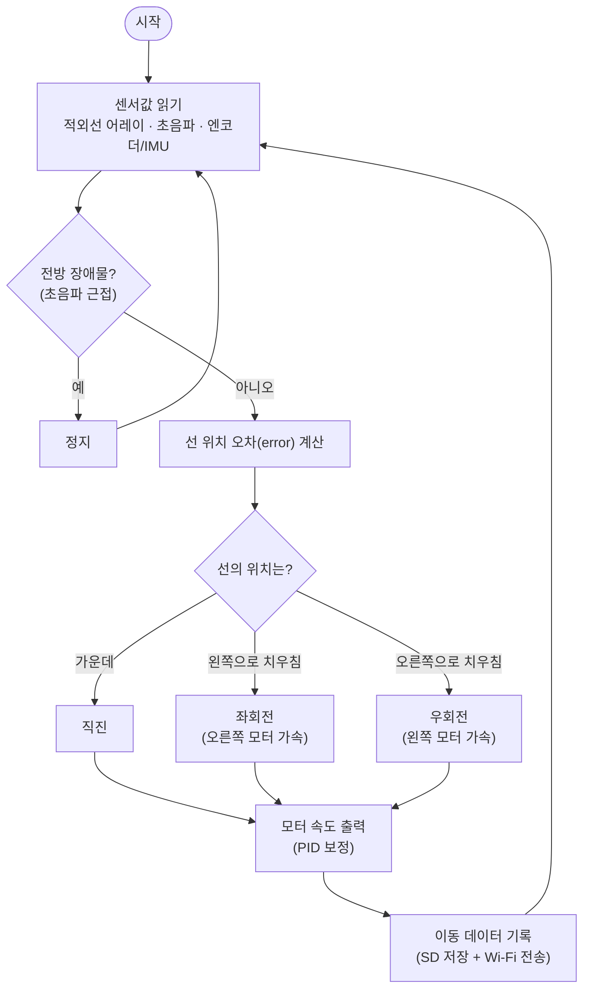

## 문제 정의
김대리는 부품과 제품을 공정 간에 운송하는 과정을 자동화하는 프로토타입 운반 로봇을 개발하고자 하며, 이 로봇은 바닥에 그려진 검은색 선(경로)을 인식하여 자율적으로 이동하고, 이동 기록 데이터를 수집하는 것이 목표로 한다


## 요구 사항 정리:
1. 바닥의 검은색 선(경로)을 인식할 수 있어야 한다.
2. 인식된 경로를 따라 자율적으로 이동할 수 있어야 한다.
3. 이동 경로와 시간, 위치 데이터를 기록하고 저장할 수 있어야 한다.
4. 실시간으로 데이터를 수집하고 저장하는 기능이 필요하다.
5. 프로토타입 하드웨어와 소프트웨어를 제작할 수 있어야 한다.

(참고사이트 : https://safetics.io/blog/250428_robot_components)

## 프로토타입 운반 로봇 센서 장치 및 필요이유
1. 적외선 반사 센서 어레이 (TCRT5000 등) : 바닥의 검은색 선(경로) 인식 — 응답이 빠르고 저렴
2. 컬러센서 : 선 색상 구분이 필요한 경우 보조 인식용
3. 휠 엔코더 (Wheel Encoder) : 바퀴 회전수 기반 이동거리·속도 측정 (이동 기록의 핵심)
4. IMU 센서 (자이로+가속도계, 예: MPU6050) : 회전각·자세 측정, 엔코더와 합쳐 실내 위치추정 정밀화
5. 초음파 센서 (HC-SR04) : 전방 거리 측정 및 추돌 방지

## 프로토타입 운반 로봇 제어 장치 및 필요이유
1. 마이크로컨트롤러(MCU) : 전체 동작 제어 — Arduino Uno 또는 Wi-Fi·블루투스 내장형 ESP32
2. 모터 드라이버 (L298N, TB6612 등) : MCU 신호로 모터를 구동 (MCU는 모터를 직접 구동 불가, 필수)
3. 데이터 저장 모듈 (SD카드 모듈) : 이동 경로·시간·위치 데이터 저장

## 프로토타입 운반 로봇 구동 장치 및 필요이유
1. DC 기어드 모터 (+엔코더 일체형) : 바퀴 구동 및 회전수 측정
2. 바퀴 + 볼 캐스터(보조바퀴) : 주행 및 차체 균형 유지
3. 섀시(프레임) : 부품을 장착하는 본체 구조

## 프로토타입 운반 로봇 전원 장치 및 필요이유
1. 배터리 (LiPo 등) : 로봇 전체 전원 공급
2. 전압 레귤레이터(BEC) : 부품별 동작 전압으로 안정적 공급

## 프로토타입 운반 로봇 통신 장치 및 필요이유
1. Wi-Fi 모듈 (ESP32 내장 또는 별도 모듈) : 데이터 통신 — 실시간 데이터 전송
2. MQTT 프로토콜 : 실시간 데이터 수집·전송에 적합한 경량 통신 방식

## 시스템 구조도
부품들이 요구사항에 맞게 동작하는 흐름 (센서(입력) → 제어(MCU) → 구동, 전원·데이터가 함께 동작)



### 요구사항 대응표
| # | 요구사항 | 담당 부품 | 동작 흐름 |
|---|---|---|---|
| ① | 검은 선(경로) 인식 | 적외선 반사 어레이 (+컬러센서) | 센서 → MCU |
| ② | 자율 주행 | MCU → 모터 드라이버 → DC 모터·바퀴 | 제어 → 구동 |
| ③ | 이동 경로·시간·위치 기록·저장 | 휠 엔코더 + IMU → MCU → SD 카드 | 피드백 → 저장 |
| ④ | 실시간 데이터 수집·전송 | MCU → Wi-Fi / MQTT | 제어 → 통신 |
| ⑤ | 하드웨어·소프트웨어 제작 | 전원부 포함 위 전체 시스템 | 전체 |

### 핵심 동작 루프
센서가 선·거리·자세를 읽음 → MCU가 판단 → 모터 드라이버로 모터를 굴려 주행 → 바퀴 회전수를 엔코더가 다시 MCU로 피드백(오도메트리)하여 위치를 추정 → 해당 데이터를 SD 카드에 저장하고 Wi-Fi로 실시간 전송한다. 이 모든 장치에 전원부가 전력을 공급한다.

## 자율주행 동작 순서도 (요구사항 ②)
센서로 선의 위치를 읽어 **오차(error)** 를 계산하고, 그 크기에 비례해 좌·우 모터 속도를 조절(PID 제어)하여 선을 따라간다. 전방 장애물이 감지되면 정지한다.



## 데이터 수집·저장 설계 (요구사항 ③④)

### 수집 항목
| 항목 | 설명 | 출처(부품) | 예시 값 |
|---|---|---|---|
| timestamp | 기록 시각 | RTC / MCU 타이머 | 2026-06-28T15:00:01.250 |
| x, y | 추정 위치 좌표 | 휠 엔코더 + IMU (오도메트리) | 1.20, 0.85 (m) |
| distance | 누적 이동거리 | 휠 엔코더 | 3.45 (m) |
| speed | 현재 속도 | 휠 엔코더 | 0.25 (m/s) |
| heading | 진행 방향(회전각) | IMU | 92.5 (°) |
| line_error | 선 인식 오차 | 적외선 반사 어레이 | -0.2 |
| obstacle_cm | 전방 장애물 거리 | 초음파 센서 | 35 (cm) |

### 저장 형식 — 로컬(SD카드, CSV)
헤더 1행 + 측정 시점마다 1행씩 추가(append)한다.
```csv
timestamp,x,y,distance,speed,heading,line_error,obstacle_cm
2026-06-28T15:00:01.250,1.20,0.85,3.45,0.25,92.5,-0.2,35
2026-06-28T15:00:01.500,1.22,0.86,3.47,0.25,92.1,-0.1,33
```

### 전송 형식 — 실시간(Wi-Fi → MQTT)
- 경로 : 로봇(ESP32) → Wi-Fi → **MQTT 브로커** → 수신 PC/서버
- 토픽(예) : `robot/agv01/telemetry`
- 페이로드(JSON 예) :
```json
{ "ts": "2026-06-28T15:00:01.250", "x": 1.20, "y": 0.85, "dist": 3.45, "speed": 0.25, "heading": 92.5, "line_err": -0.2, "obs": 35 }
```

## 검은 선 인식 원리 (요구사항 ①)
적외선 반사 센서(예: TCRT5000)는 **색을 보는 것이 아니라 반사된 적외선의 양**을 측정한다.
- 센서는 적외선 LED(약 950nm)로 바닥에 빛을 쏘고, 그 옆의 수광 트랜지스터가 **되돌아온 빛의 양**을 읽는다.
- **흰색 바닥** : 적외선을 많이 반사 → 수광량 많음
- **검은색 선** : 적외선을 대부분 흡수 → 반사 적음 → 수광량 적음

| 바닥 색 | 적외선 반사 | 센서 수광량 | 판단 |
|---|---|---|---|
| 흰색 (바닥) | 많음 | 큼 | 선 아님 |
| 검은색 (경로) | 적음 | 작음 | 선 위 |

- **임계값(threshold)** : 수광량(아날로그 값)이 기준값보다 작으면 "검은 선", 크면 "흰 바닥"으로 판정(디지털 HIGH/LOW). 기준값은 가변저항(포텐셔미터) 또는 코드로 설정한다.
- **캘리브레이션** : 조명·바닥 재질·센서 높이에 따라 반사량이 달라지므로, 사용 전에 흑·백 위에서 측정해 임계값을 보정해야 한다.
- 센서를 **여러 개 나열(어레이)** 하면 선이 차체의 왼쪽/가운데/오른쪽 중 어디에 있는지를 알 수 있고, 이 값이 ②번 자율주행의 오차(error) 입력이 된다.

## 전체 제작 구성 (요구사항 ⑤)
앞에서 정의한 부품·구조도·알고리즘을 종합하면 하드웨어와 소프트웨어가 다음과 같이 구성된다.

**하드웨어** : 섀시(프레임) 위에 DC 기어드 모터·바퀴·볼캐스터로 구동부를 만들고, 앞바닥에 적외선 반사 어레이(선 인식)와 초음파 센서(추돌 방지)를, 바퀴축에 엔코더, 본체에 IMU를 부착한다. MCU(Arduino/ESP32)가 모터 드라이버를 통해 모터를 제어하고, SD카드 모듈로 데이터를 저장하며, 전원부(배터리+레귤레이터)가 전체에 전력을 공급한다.

**소프트웨어** : 기능을 역할별 모듈로 나누어 구성한다. (본 과제는 별도의 구현 과정을 포함하지 않으므로 아래는 **설계** 수준의 기술이다.)

| 기능 모듈 | 역할 | 요구 |
|---|---|---|
| 인식 | 적외선 어레이·초음파 읽기, 선 위치 오차 계산 | ① |
| 제어 | 오차 기반 PID 제어로 주행·조향, 장애물 시 정지 | ② |
| 기록 | 엔코더·IMU 기반 위치 추정 후 데이터 저장(CSV) | ③ |
| 통신 | 수집 데이터를 Wi-Fi로 실시간 전송 | ④ |

처리 흐름: 인식 → 제어 → 구동, 그리고 위치·이동 데이터를 기록·전송한다. (동작 흐름은 위 "자율주행 동작 순서도" 참조)

## 요구사항 충족 최종 점검
| # | 요구사항 | 충족 방법 | 충족 |
|---|---|---|---|
| ① | 검은 선(경로) 인식 | 적외선 반사 어레이 + 임계값 판정 | ✅ |
| ② | 경로 따라 자율 이동 | 오차 기반 PID 제어 → 모터 드라이버·모터 (순서도) | ✅ |
| ③ | 이동 경로·시간·위치 기록·저장 | 엔코더+IMU 오도메트리 → SD카드 CSV | ✅ |
| ④ | 실시간 데이터 수집·전송 | Wi-Fi → MQTT 실시간 전송 | ✅ |
| ⑤ | 하드웨어·소프트웨어 제작 | 위 부품 구성으로 HW/SW 통합 (구조도) | ✅ |
