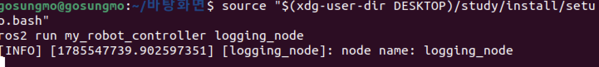
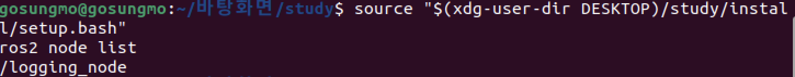

# 과정2 · 과제5 — rclpy `Node` 상속으로 파이썬 노드 작성 · ROS2 로깅 실습

> **작성자** : SUNGMO  **작성일** : 2026-08-01
> **산출물** : 본 문서(`5_ros2_python_node.md`) · 노드 소스(`logging.py`) · 워크스페이스 압축(`5_ros2_ws.zip`)
> **실습 환경** : Apple Silicon Mac(M5 Pro) 위 UTM 가상머신 — **Ubuntu 22.04.5 LTS (arm64)** · bash 셸 · **ROS2 Humble** · 과제4에서 만든 `~/ros2_ws` 워크스페이스와 `my_robot_controller` 패키지를 이어서 사용

---

## 0. 수행 목표

- **ROS2의 노드를 파이썬으로 작성한다.**

과제3에서 노드의 개념을, 과제4에서 패키지의 틀(`my_robot_controller`)을 배웠다. 이번에는 그 틀 안에 **첫 노드 코드를 직접 작성**한다 — 자신의 이름을 정보(info) 수준 로그로 기록하고, 로봇이 계속 동작하듯 실행 상태로 남아 있는 `logging_node` 를 만든다.

> **용어**
> - **rclpy** : ROS2의 공식 파이썬 클라이언트 라이브러리(과제4의 4장). 파이썬 코드에서 노드 생성·통신 등 ROS2 기능을 쓰게 해 주는 다리다.
> - **로그(log)** : 프로그램이 동작 중에 남기는 시간순 기록. 화면 출력과 달리 파일·네트워크로도 보낼 수 있어 "지금 안 보고 나중에/멀리서 확인"이 가능하다.

---

## 1. `Node` 클래스를 상속받아 노드 클래스 작성하기

### 1-1. 왜 상속인가

ROS2 프로그램은 각 구성 요소를 노드로 정의하고 노드 간 상호작용을 조립하는 방식으로 만든다. 이때 모든 노드에 공통으로 필요한 기능 — 이름 등록, 로거, 타이머, 퍼블리셔/서브스크라이버 생성 등 — 은 `rclpy.node` 모듈의 **`Node` 클래스**에 이미 구현되어 있다. 그래서 파이썬 노드는 이 클래스를 **상속(inheritance)** 받아, 공통 기능은 물려받고 내 노드만의 동작만 추가로 작성한다.

> **용어**
> - **상속** : 기존 클래스(부모)의 기능을 물려받아 새 클래스(자식)를 만드는 객체지향 문법. `class 자식(부모):` 형태로 쓴다.

### 1-2. 작성 방법

```python
from rclpy.node import Node          # rclpy.node 모듈에서 Node 클래스를 가져옴

class LoggingNode(Node):             # Node 를 상속받은 내 노드 클래스
    def __init__(self):
        super().__init__('logging_node')   # 부모 생성자에 노드 이름을 넘겨 등록
```

- `super().__init__('logging_node')` — 부모(`Node`)의 생성자를 호출하면서 **노드 이름**을 넘긴다. 이 한 줄로 ROS 그래프에 `/logging_node` 라는 이름의 노드가 등록된다.
- 이름을 등록한 뒤부터는 `self.get_name()`(이름 조회), `self.get_logger()`(로거, 3장) 같은 `Node` 의 메서드를 자유롭게 쓸 수 있다.

---

## 2. 노드 객체의 생성과 rclpy 생명주기 3함수

노드 클래스를 정의했다고 노드가 실행되는 것은 아니다. **rclpy를 초기화 → 객체 생성 → 실행 유지 → 종료**의 순서를 지켜야 하며, 이 흐름을 담당하는 세 함수가 있다.

| 함수 | 역할 | 호출 시점 |
|------|------|------|
| `rclpy.init()` | rclpy 통신 계층(컨텍스트)을 초기화 — DDS 통신 준비 | **노드 객체를 만들기 전** 반드시 1회 |
| `rclpy.spin(node)` | 노드를 **실행 상태로 유지**하며 타이머·구독 등 콜백을 처리하는 **블로킹 함수** — 종료 신호(Ctrl+C 등)가 올 때까지 반환하지 않음 | 노드 객체 생성 후 |
| `rclpy.shutdown()` | 통신 계층을 종료하고 자원을 반환 | 프로그램을 끝내기 전 |

```python
def main(args=None):
    rclpy.init(args=args)     # ① 초기화 — 이걸 빼먹고 Node 를 만들면 오류
    node = LoggingNode()      # ② 노드 객체 생성 (1장의 클래스 사용)
    rclpy.spin(node)          # ③ 여기서 멈춰서 계속 실행 — "로봇이 계속 동작하는 상태"
    rclpy.shutdown()          # ④ 종료 정리
```

- `spin` 은 "바퀴가 계속 도는" 이미지 그대로, 노드를 살려 둔 채 이벤트를 무한히 처리하는 대기 루프다. 이번 노드는 콜백이 없지만 **spin 덕분에 프로그램이 종료되지 않고 실행 상태로 남는다.**
- **Ctrl+C 종료 시 주의** : `spin()` 도중 Ctrl+C 를 누르면 rclpy가 종료 절차를 시작하면서 `KeyboardInterrupt` 가 발생한다. 이 상태에서 `rclpy.shutdown()` 을 또 호출하면 "이미 종료된 컨텍스트"라며 오류가 날 수 있어, 실전 코드(4장)에서는 **이미 종료됐으면 조용히 건너뛰는 `rclpy.try_shutdown()`** 을 사용했다.

---

## 3. ROS2 로깅 — print() 대신 로그

### 3-1. 왜 print()가 아닌가

일반 파이썬 프로그램은 `print()` 로 화면에 메시지를 띄우지만, **로봇에는 그 화면이 없다.** 대신 ROS2 노드는 파이썬 로깅 시스템과 연동된 **로거(logger)** 로 기록을 남긴다. 로그는 화면 출력과 달리 ▸ 수준(중요도)별로 걸러 볼 수 있고 ▸ 파일로 저장되며 ▸ 토픽으로도 발행되어 **네트워크 건너편(개발자 PC)에서 수집**할 수 있다.

### 3-2. 로그 남기는 방법 — `get_logger()`

`Node` 를 상속받은 클래스 안에서는 `self.get_logger()` 로 이 노드 전용 로거를 얻고, 수준별 메서드로 기록한다.

```python
self.get_logger().info('메시지')     # 정보 수준 로그
```

| 수준 | 메서드 | 용도 |
|------|------|------|
| DEBUG | `.debug()` | 개발 중 상세 진단용 (기본 설정에선 화면에 안 나옴) |
| **INFO** | **`.info()`** | **정상 동작 알림 — 이번 과제에서 사용** |
| WARN | `.warning()` | 당장 오류는 아니지만 주의할 상황 |
| ERROR | `.error()` | 기능 일부가 실패한 오류 |
| FATAL | `.fatal()` | 복구 불가능한 치명적 오류 |

기본 출력 수준은 **INFO** — INFO 이상(INFO·WARN·ERROR·FATAL)만 출력되고 DEBUG는 걸러진다. 로그 한 줄은 다음 형식으로 찍힌다.

```
[수준] [유닉스시각] [노드이름]: 메시지
```

### 3-3. 남긴 로그를 확인하는 방법 4가지

| 방법 | 명령/위치 | 특징 |
|------|------|------|
| ① 실행 터미널 | `ros2 run ...` 을 실행한 화면 | 가장 즉각적 — 단, 로봇엔 화면이 없을 수 있음 |
| ② 로그 파일 | `~/.ros/log/` 디렉토리 | 노드별 `.log` 파일로 저장 — 사후 분석용 |
| ③ `/rosout` 토픽 | `ros2 topic echo /rosout` (다른 터미널) | 로그가 **토픽으로도 발행**됨 — 네트워크 너머에서 실시간 수집 가능. "화면 없는 로봇"의 해답 |
| ④ rqt_console | `ros2 run rqt_console rqt_console` | GUI로 수준별 필터·검색 |

---

## 4. `logging.py` 작성

### 4-1. 만들 노드의 동작

- 노드 이름은 `logging_node`, 파일 이름은 `logging.py`
- 시작하면 **자신의 노드 이름을 정보(info) 수준 로그로 기록**
- 이후 로봇이 동작하듯 **프로그램이 계속 실행 상태로 유지**

### 4-2. 파일 위치

노드 코드는 과제4에서 확인한 구조대로 **패키지와 같은 이름의 파이썬 모듈 폴더** 안에 둔다.

```
~/ros2_ws/src/my_robot_controller/my_robot_controller/logging.py
```

### 4-3. 전체 코드

```python
import rclpy
from rclpy.node import Node


class LoggingNode(Node):
    """생성되면 자신의 이름을 정보(info) 수준 로그로 기록하고 실행 상태를 유지하는 노드."""

    def __init__(self):
        super().__init__('logging_node')                         # 노드 이름 등록
        self.get_logger().info(f'node name: {self.get_name()}')  # 노드 이름을 info 로그로 기록


def main(args=None):
    rclpy.init(args=args)        # ① rclpy(통신 계층) 초기화
    node = LoggingNode()         # ② 노드 객체 생성 — 이때 __init__ 의 로그가 1회 기록됨
    try:
        rclpy.spin(node)         # ③ 종료 신호가 올 때까지 실행 상태 유지
    except KeyboardInterrupt:    #    Ctrl+C 로 종료
        pass
    finally:
        node.destroy_node()      # ④ 노드 정리
        rclpy.try_shutdown()     # ⑤ rclpy 종료 (이미 종료됐으면 건너뜀)


if __name__ == '__main__':
    main()
```

- 노드 이름을 문자열로 다시 쓰지 않고 `self.get_name()` 으로 조회해 기록했다 — 이름을 바꿔도 로그가 자동으로 따라온다.
- `main(args=None)` 형태로 만들어 두면 5장의 `entry_points` 가 이 함수를 실행 진입점으로 삼는다.

> **주의 — 파일 이름 `logging.py` 와 표준 라이브러리 충돌**
> 파이썬 표준 라이브러리에도 `logging` 모듈이 있다. 우리 파일은 패키지 **하위 모듈**(`my_robot_controller.logging`)로 임포트되므로 표준 `logging` 을 가리지 않아 안전하지만, 이 폴더에서 `python3 logging.py` 로 **단독 실행하면** 스크립트 자신이 표준 모듈을 가려(이름 가림, shadowing) 오류가 날 수 있다. **노드는 반드시 7장의 `ros2 run` 으로 실행한다.**

---

## 5. `setup.py` 수정 — 실행 진입점 등록

과제4의 7장에서 "노드 코드를 작성하면 여기에 등록한다"고 미뤄 둔 자리 — `entry_points` 의 `console_scripts` — 를 채울 차례다.

```python
    entry_points={
        'console_scripts': [
            'logging_node = my_robot_controller.logging:main',
        ],
    },
```

형식은 `'실행이름 = 패키지.모듈:함수'` 다.

| 부분 | 의미 |
|------|------|
| `logging_node` (왼쪽) | `ros2 run` 에서 부를 **실행파일 이름** — 노드 이름과 같게 맞췄다 |
| `my_robot_controller.logging` | 패키지 모듈 폴더 안의 `logging.py` |
| `:main` | 그 파일에서 실행할 함수 |

빌드하면 setuptools가 이 정보로 `lib/my_robot_controller/logging_node` 실행파일을 만들어 주고(설치 경로는 `setup.cfg` 가 지정 — 과제4의 7장), `ros2 run` 이 그것을 찾아 실행한다. 나머지 항목(`packages`·`data_files` 등)은 과제4에서 생성된 그대로 수정하지 않았다.

---

## 6. 빌드 — `colcon build --symlink-install`

### 6-1. 빌드 실행

빌드는 항상 **워크스페이스 루트**에서 실행한다(과제4의 1장).

```bash
cd ~/ros2_ws
colcon build --symlink-install
```

```
Starting >>> my_robot_controller
Finished <<< my_robot_controller [...]

Summary: 1 package finished [...]
```

### 6-2. `--symlink-install` 옵션의 역할

기본 빌드는 파이썬 소스를 `install/` 에 **복사**한다. 그러면 `logging.py` 를 한 줄만 고쳐도 매번 다시 빌드해야 고친 내용이 반영된다. `--symlink-install` 은 복사 대신 **심볼릭 링크(symlink — 원본을 가리키는 바로가기)** 로 설치하므로, `src/` 의 소스를 수정하면 **재빌드 없이 즉시** 실행에 반영된다. 파이썬처럼 컴파일이 없는 언어에서 개발 속도를 크게 높여 주는 옵션이다.

단, **새 파일을 추가하거나 `setup.py`(진입점)를 바꿨을 때는** 링크·실행파일 자체를 다시 만들어야 하므로 재빌드가 필요하다.

### 6-3. 빌드 오류가 나는 경우 — setuptools 버전 조정

Ubuntu 22.04 기본 setuptools(59.6.0)에서는 빌드 중 `setup.py install/develop is deprecated` 경고가 나올 수 있다(경고는 무시해도 된다). 만약 `--symlink-install` 빌드가 경고가 아니라 **오류로 중단**되면, ROS2 Humble과 궁합이 맞는 버전으로 내려서 해결한다.

```bash
pip3 install setuptools==58.2.0
```

---

## 7. 적용과 실행

### 7-1. 빌드 결과를 시스템에 적용 — 오버레이 소싱

빌드가 끝나도 새 터미널은 아직 내 패키지를 모른다. `install/` 안의 `setup.bash` 를 소싱해 **워크스페이스 오버레이**(과제4의 1장)를 현재 셸에 적용해야 한다.

```bash
source ~/ros2_ws/install/setup.bash
```

(언더레이 `/opt/ros/humble/setup.bash` 는 `~/.bashrc` 에서 이미 소싱된다 — 과제2)

### 7-2. 노드 실행

```bash
ros2 run my_robot_controller logging_node
```

```
[INFO] [1754...]: [logging_node]: node name: logging_node
```

- **노드 이름이 정보 수준(`[INFO]`) 로그로 기록**되고, 프롬프트가 돌아오지 않은 채 **프로그램이 계속 실행 상태로 남는다**(`rclpy.spin`) — 목표한 두 동작 모두 확인.
- 종료는 Ctrl+C.



### 7-3. 교차 확인 — 다른 터미널에서

```bash
ros2 node list        # → /logging_node  (과제3의 노드 명령으로 등록 확인)
ros2 topic echo /rosout   # 실행 순간의 info 로그가 토픽으로도 수집되는지 확인 (3-3의 ③)
```



---

## 8. 결과 요약

| 항목 | 결과 |
|------|------|
| 노드 클래스 | `rclpy.node.Node` 상속 + `super().__init__('logging_node')` 로 이름 등록 |
| 생명주기 3함수 | `rclpy.init()`(초기화) → `rclpy.spin()`(실행 유지·블로킹) → `rclpy.shutdown()`(종료, 코드에선 안전한 `try_shutdown()` 사용) |
| 로깅 | `self.get_logger().info()` 로 노드 이름 기록 — 수준 5종(DEBUG~FATAL), 기본 출력 INFO |
| 로그 확인 | 터미널 · `~/.ros/log/` 파일 · `/rosout` 토픽 · rqt_console |
| setup.py | `console_scripts` 에 `'logging_node = my_robot_controller.logging:main'` 등록 |
| 빌드 | `colcon build --symlink-install` — 소스 수정이 재빌드 없이 반영(심볼릭 링크 설치) |
| 실행 | `source install/setup.bash` → `ros2 run my_robot_controller logging_node` → `[INFO]` 로그 확인, `ros2 node list` 에 `/logging_node` |

**산출물**
- 문서 : `과정2/과제5/5_ros2_python_node.md` (본 문서)
- 소스 : `과정2/과제5/logging.py` — VM의 `~/ros2_ws/src/my_robot_controller/my_robot_controller/logging.py` 와 동일본
- 압축 : `5_ros2_ws.zip` — 워크스페이스 디렉토리 압축. `build/`·`install/`·`log/` 는 빌드 시 재생성되는 산출물이므로 제외하고 압축했다.

```bash
cd ~
zip -r 5_ros2_ws.zip ros2_ws -x "ros2_ws/build/*" "ros2_ws/install/*" "ros2_ws/log/*"
```

---

## 9. 참고자료

**파이썬 노드 작성 (공식 튜토리얼 · API)**
- 첫 파이썬 노드 작성(Node 상속·entry_points 등록·빌드·실행 전 과정) : https://docs.ros.org/en/humble/Tutorials/Beginner-Client-Libraries/Writing-A-Simple-Py-Publisher-And-Subscriber.html
- rclpy API 문서(init·spin·shutdown·Node·get_logger) : https://docs.ros2.org/foxy/api/rclpy/index.html
- rclpy 소스코드(ros2/rclpy) : https://github.com/ros2/rclpy

**로깅 (공식 문서)**
- ROS2 로깅 개념(수준·로그 파일 위치·/rosout) : https://docs.ros.org/en/humble/Concepts/Intermediate/About-Logging.html
- 로깅 데모·로거 설정(출력 형식·환경변수) : https://docs.ros.org/en/humble/Tutorials/Demos/Logging-and-logger-configuration.html
- rqt_console 로 로그 보기 : https://docs.ros.org/en/humble/Tutorials/Beginner-CLI-Tools/Using-Rqt-Console/Using-Rqt-Console.html

**빌드 · 실행 (공식 튜토리얼)**
- colcon 으로 패키지 빌드하기(--symlink-install) : https://docs.ros.org/en/humble/Tutorials/Beginner-Client-Libraries/Colcon-Tutorial.html
- 첫 ROS2 패키지 만들기(빌드 후 소싱·ros2 run) : https://docs.ros.org/en/humble/Tutorials/Beginner-Client-Libraries/Creating-Your-First-ROS2-Package.html
