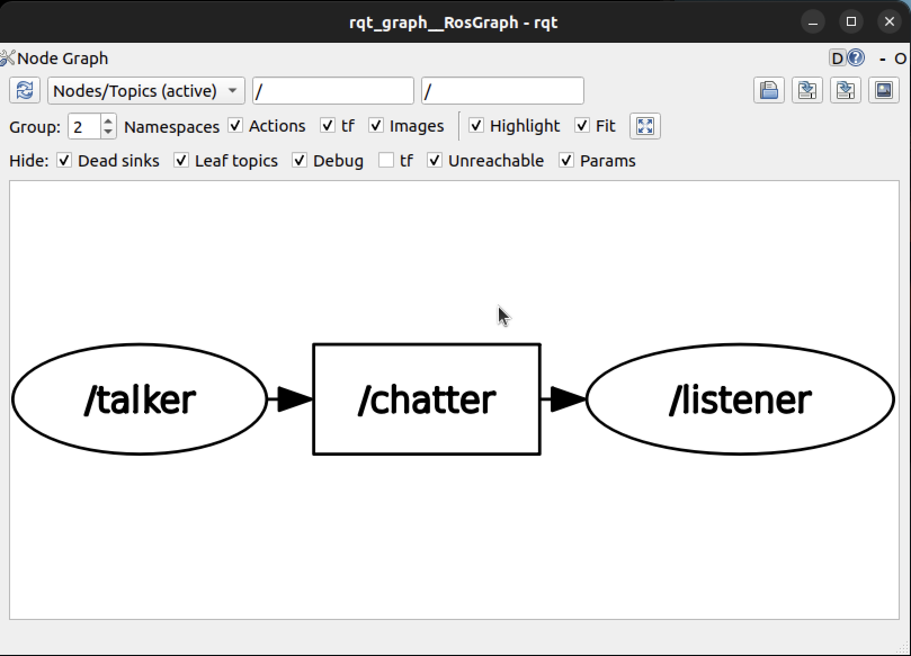
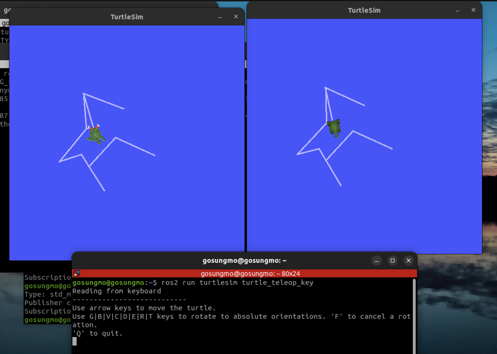
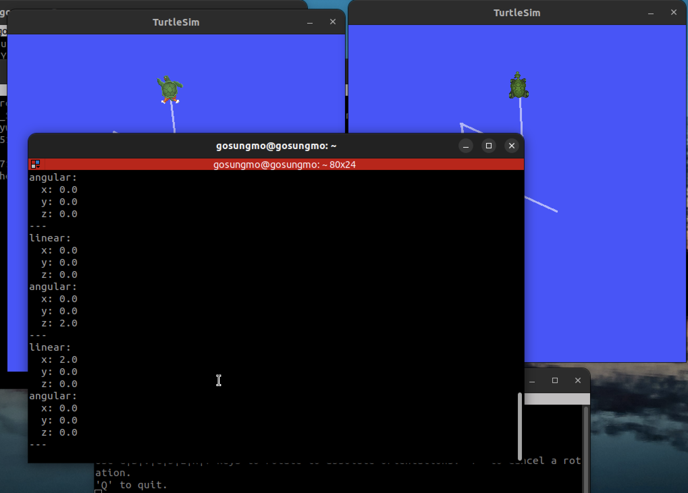

# 과정2 · 과제7 — ROS2 토픽(topic) · 발행-구독 통신 실습

> **작성자** : SUNGMO  **작성일** : 2026-08-01
> **산출물** : 본 문서(`7_topic.md`) · 이미지 3장(`7_rqt_graph.png` · `7_turtlesim.png` · `7_cmd_vel_echo.png`)
> **실습 환경** : Apple Silicon Mac(M5 Pro) 위 UTM 가상머신 — **Ubuntu 22.04.5 LTS (arm64)** · bash 셸 · **ROS2 Humble**

---

## 0. 수행 목표

- **ROS2의 토픽에 대해서 학습한다.**

과제3에서 노드 사이에 "토픽이라는 통로"가 있다는 것까지 확인했다. 이번에는 그 통로의 정체 — **발행-구독(publish-subscribe) 통신** — 를 파고든다. 명령으로 토픽을 들여다보고, 노드 수를 바꿔 가며 토픽이 1:1 연결이 아니라 **다대다(N:M) 통신**임을 실험으로 확인한다.

---

## 1. 토픽이란 — 발행-구독 통신

**토픽(topic)** 은 노드들이 데이터를 주고받는 **이름 붙은 통신 채널**이다. 동작 방식은 발행-구독 모델을 따른다.

- **게시자(publisher)** : 토픽 이름(예: `/chatter`)에 메시지를 계속 실어 보내는 쪽
- **구독자(subscription)** : 같은 토픽 이름을 구독해 두고, 메시지가 올 때마다 콜백(과제6)으로 받아 처리하는 쪽

핵심 성질은 두 가지다.

1. **익명(anonymous) 통신** — 게시자는 누가 받는지, 구독자는 누가 보내는지 서로 모른다. 노드들은 오직 **토픽 "이름"과 메시지 "유형"** 만 맞추면 연결된다. 그래서 노드를 서로 수정 없이 갈아 끼울 수 있다.
2. **다대다(N:M)** — 한 토픽에 게시자도 여러 개, 구독자도 여러 개 붙을 수 있다(5장에서 실험). 토픽은 두 노드를 잇는 전용선이 아니라 **여러 노드가 드나드는 버스**다.

> **용어**
> - **발행(publish)/구독(subscribe)** : 신문 발행-구독과 같은 구조. 발행사는 구독자 명단을 몰라도 신문을 찍고, 구독자는 발행사 내부를 몰라도 신문을 받는다.
> - **메시지(message)** : 토픽으로 흐르는 데이터 한 건. 형(type)이 정해져 있다(4장).

---

## 2. rqt_graph 로 토픽 관찰 — Nodes/Topics (active)

demo_nodes_cpp 패키지의 talker·listener 노드를 실행한 상태에서 `rqt_graph` 를 실행하고, 상단 드롭다운을 과제3에서 쓰던 **Nodes only** 대신 **Nodes/Topics (active)** 로 바꾼다.

- **Nodes only** : 노드(타원)만 표시 — 토픽은 화살표 위 라벨로만 보인다.
- **Nodes/Topics (active)** : 현재 활성 상태인 **토픽이 사각형 정점으로 직접 표시**된다 — `/talker` (타원) → `/chatter` (사각형) → `/listener` (타원) 의 3단 구조.

**연결선의 방향성** : 화살표는 **데이터가 흐르는 방향**이다. `/talker → /chatter` 화살표는 "talker가 이 토픽에 발행한다", `/chatter → /listener` 화살표는 "listener가 이 토픽을 구독한다"는 뜻 — 토픽을 가운데 두고 발행 방향과 구독 방향이 명확히 구분된다.



---

## 3. `ros2 topic` 명령 3종

토픽 관련 조작은 `ros2 topic <하위명령>` 으로 한다. 두 노드가 실행 중인 상태에서 **다른 터미널**에서 실행했다.

### 3-1. `ros2 topic list` — 현재 토픽 목록

```
$ ros2 topic list
/chatter
/parameter_events
/rosout
```

- `/chatter` : talker→listener 의 데이터 토픽
- `/parameter_events`·`/rosout` : 모든 노드가 기본으로 만드는 토픽 — 파라미터 변경 알림용, 로그 수집용(과제5의 3-3에서 본 `/rosout` 이 바로 이것)

### 3-2. `ros2 topic info /chatter` — 토픽의 정보

```
$ ros2 topic info /chatter
Type: std_msgs/msg/String
Publisher count: 1
Subscription count: 1
```

- **Type** : 이 토픽으로 흐르는 **메시지의 유형** — `std_msgs` 패키지의 `String`(문자열) 메시지 (4장)
- **Publisher count / Subscription count** : 현재 이 토픽에 붙어 있는 **게시자/구독자의 수** — 지금은 talker 1개, listener 1개

### 3-3. `ros2 topic echo /chatter` — 토픽 내용 실시간 출력

```
$ ros2 topic echo /chatter
data: 'Hello World: 121'
---
data: 'Hello World: 122'
---
data: 'Hello World: 123'
---
```

`echo` 는 **이 터미널 자신이 임시 구독자가 되어** 토픽에 흐르는 메시지 내용을 실시간으로 보여준다. 익명 다대다 통신(1장)이기 때문에 가능한 일이다 — talker는 구독자가 하나 늘어난 것을 신경 쓰지 않고, listener의 수신도 방해받지 않는다. 디버깅할 때 "지금 이 토픽에 뭐가 흐르나"를 보는 기본 도구다. (종료는 Ctrl+C)

---

## 4. 기본 메시지 유형 — std_msgs

`ros2 topic info` 에서 확인한 `std_msgs/msg/String` 은 "**std_msgs 패키지의 msg 폴더에 정의된 String 형**"이라는 뜻이다. `std_msgs` 는 ROS2가 기본 제공하는 **단순 데이터형 메시지 모음**이다.

| 분류 | 메시지 유형 | 담는 값 |
|------|------|------|
| 문자열 | `String` | 문자열 `data` 필드 하나 |
| 논리 | `Bool` | 참/거짓 |
| 정수 | `Int8` `Int16` `Int32` `Int64` / `UInt8`~`UInt64` | 크기·부호별 정수 |
| 실수 | `Float32` `Float64` | 단정도/배정도 실수 |
| 배열 | `Int32MultiArray` `Float64MultiArray` 등 | 같은 형의 배열 + 배치 정보 |
| 기타 | `Empty`(내용 없음 — 신호용) · `Header`(시각·좌표계 스탬프) · `ColorRGBA`(색) | |

- 메시지 형의 내부 구조는 `ros2 interface show std_msgs/msg/String` 처럼 확인할 수 있다 — String 은 `string data` 필드 하나짜리다.
- 실제 로봇 데이터는 단순형만으로 부족하므로 **용도별 메시지 패키지**를 쓴다 — 기하/이동 명령은 `geometry_msgs`(6장의 Twist), 센서는 `sensor_msgs` 등. std_msgs 는 그 출발점이 되는 기본형 모음이다.

---

## 5. 실험 — 게시자·구독자 수를 바꿔 보기

토픽이 정말 다대다인지, talker·listener 개수를 바꿔 가며 `ros2 topic info /chatter` 로 확인했다.

| 상황 | Publisher count | Subscription count |
|------|------|------|
| talker 1 + listener 1 (기본) | 1 | 1 |
| talker 1 + **listener 2** | 1 | **2** |
| **talker 2** + listener 1 | **2** | 1 |
| **talker 2 + listener 2** | **2** | **2** |

**의미하는 바**

- 토픽은 두 노드 사이의 전용 연결이 아니라, **같은 이름을 쓰는 모든 노드가 자유롭게 붙는 공유 버스**다. 노드를 추가할 때 기존 노드를 전혀 수정하지 않았다는 점이 핵심이다.
- listener 가 2개면 **같은 메시지가 두 구독자 모두에게 전달**된다(복사 배달). talker 가 2개면 두 발행자의 메시지가 **한 토픽에 섞여 흐르고**, 구독자는 그 전부를 받는다.
- 발행자는 구독자가 0명이어도, 100명이어도 똑같이 동작한다 — 이 **느슨한 결합** 덕분에 로봇 시스템에 모니터링·기록 노드를 언제든 끼워 넣을 수 있다.

---

## 6. turtlesim 으로 확인 — 노드 3개, 토픽 1개

demo_nodes_cpp 노드를 모두 종료하고, **turtlesim_node 2개 + turtle_teleop_key 1개**를 세 터미널에서 실행했다.

### 6-1. 현상 — 키 하나에 거북이 두 마리

teleop 터미널에서 화살표 키를 누르면 **두 개의 turtlesim 창에서 두 거북이가 완전히 똑같이 움직인다.** (turtlesim_node 를 두 개 실행하면 노드 이름 중복 경고가 나올 수 있으나 통신에는 지장이 없다.)



### 6-2. 토픽 정보 확인 — /turtle1/cmd_vel

```
$ ros2 topic info /turtle1/cmd_vel
Type: geometry_msgs/msg/Twist
Publisher count: 1
Subscription count: 2
```

- **게시자 1** = turtle_teleop_key, **구독자 2** = 두 개의 turtlesim_node — 6-1 현상의 정체가 이 두 줄로 설명된다.
- **토픽 형** : `geometry_msgs/msg/Twist` — 로봇의 속도 명령을 담는 표준 메시지로, **linear**(직진 속도 x·y·z)와 **angular**(회전 속도 x·y·z) 두 벡터로 구성된다. 과제1의 차동구동 로봇도 결국 이런 (직진, 회전) 속도 쌍으로 제어된다.

### 6-3. 토픽 내용 — echo 로 명령 엿보기

`ros2 topic echo /turtle1/cmd_vel` 을 켜 둔 상태에서 화살표 키(전진)를 누르면 그 순간의 속도 명령이 보인다.

```
linear:
  x: 2.0
  y: 0.0
  z: 0.0
angular:
  x: 0.0
  y: 0.0
  z: 0.0
---
```

전진 키는 "직진 x 방향 2.0, 회전 없음"이라는 Twist 메시지 한 건으로 번역되어 토픽에 실린다.



### 6-4. 세 노드 사이에서 벌어지고 있는 일 — 정리

1. **turtle_teleop_key** 는 키 입력을 받으면 그것을 **Twist 속도 명령으로 번역**해 `/turtle1/cmd_vel` 토픽에 **발행**한다. 이 노드는 거북이가 몇 마리인지 전혀 모른다.
2. **두 turtlesim_node** 는 각자 `/turtle1/cmd_vel` 을 **구독**하고 있다가, 도착한 같은 Twist 메시지를 각자의 콜백으로 받아 **각자의 거북이를 같은 속도로 움직인다.**
3. 그 결과가 "키 하나에 두 마리가 동시에 움직이는" 현상이다 — 발행자와 구독자가 서로를 모른 채 **토픽 이름만으로 묶이는 다대다 통신**(1장·5장)이 실제 로봇 조종 구조에서 그대로 재현된 것이다. 같은 원리로, 실제 로봇에서도 하나의 속도 명령 토픽을 구동 노드·기록 노드·안전감시 노드가 동시에 받아 쓸 수 있다.

---

## 7. 결과 요약

| 항목 | 결과 |
|------|------|
| 토픽 | 이름 붙은 발행-구독 통신 채널 — 익명·다대다, 노드 간 느슨한 결합 |
| rqt_graph | Nodes/Topics (active) 모드에서 토픽이 사각형 정점으로 표시 — 화살표 방향 = 데이터 흐름(발행→토픽→구독) |
| ros2 topic 명령 | `list`(토픽 목록) · `info`(메시지 형과 게시/구독 수) · `echo`(임시 구독자로 내용 실시간 확인) |
| 기본 메시지 유형 | `std_msgs` — String·Bool·Int/UInt 계열·Float 계열·MultiArray·Empty·Header 등. 구조 확인은 `ros2 interface show` |
| 게시/구독 수 실험 | 1+2 → 구독 2, 2+1 → 게시 2, 2+2 → 각 2 — 노드 수정 없이 자유로운 다대다 접속 확인 |
| turtlesim 2+1 | 게시 1(teleop)·구독 2(turtlesim×2), 형 `geometry_msgs/msg/Twist` — 키 하나에 두 거북이가 동시에 움직이는 이유를 토픽 구조로 설명 |

**산출물**
- 문서 : `과정2/과제7/7_topic.md` (본 문서)
- 이미지 : `7_rqt_graph.png`(활성 토픽 그래프) · `7_turtlesim.png`(두 거북이 동시 이동) · `7_cmd_vel_echo.png`(속도 명령 내용)

---

## 8. 참고자료

**토픽 (공식 개념 문서 · 튜토리얼)**
- 토픽 개념(발행-구독·익명·다대다) : https://docs.ros.org/en/humble/Concepts/Basic/About-Topics.html
- 토픽 이해(rqt_graph·ros2 topic list/info/echo) : https://docs.ros.org/en/humble/Tutorials/Beginner-CLI-Tools/Understanding-ROS2-Topics/Understanding-ROS2-Topics.html
- 인터페이스(메시지 형) 개념 : https://docs.ros.org/en/humble/Concepts/Basic/About-Interfaces.html

**메시지 유형 · 데모 (공식 소스)**
- std_msgs 메시지 정의 목록 : https://github.com/ros2/common_interfaces/tree/humble/std_msgs/msg
- geometry_msgs Twist 메시지 정의 : https://github.com/ros2/common_interfaces/blob/humble/geometry_msgs/msg/Twist.msg
- 데모 노드 소스(demo_nodes_cpp) : https://github.com/ros2/demos
- turtlesim 소개 : https://docs.ros.org/en/humble/Tutorials/Beginner-CLI-Tools/Introducing-Turtlesim/Introducing-Turtlesim.html
