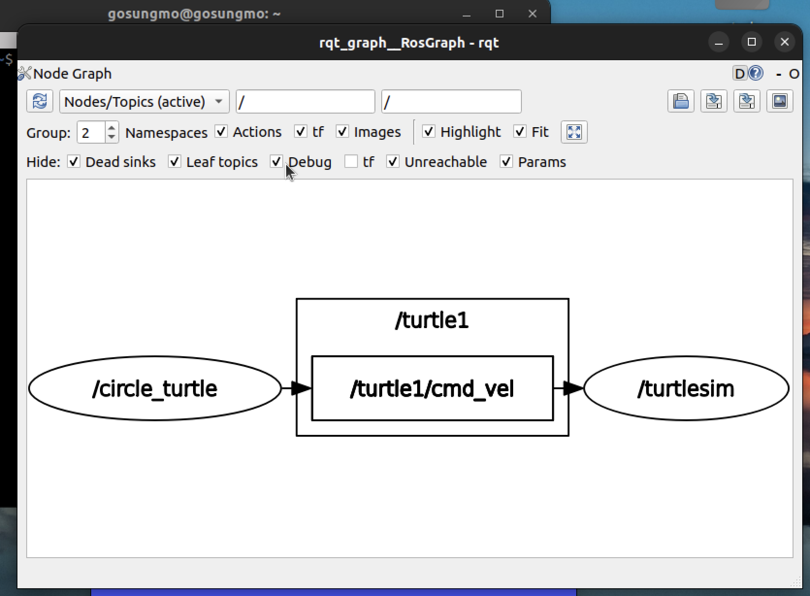

# 과정2 · 과제8 — 퍼블리셔(게시자) · 파이썬으로 거북이 조종하기

> **작성자** : SUNGMO  **작성일** : 2026-08-01
> **산출물** : 본 문서(`8_publisher.md`) · 노드 소스(`circle_turtle.py`) · rqt_graph 이미지(`8_rqt_graph.png`) · 워크스페이스 압축(`8_ros2_ws.zip`)
> **실습 환경** : Apple Silicon Mac(M5 Pro) 위 UTM 가상머신 — **Ubuntu 22.04.5 LTS (arm64)** · bash 셸 · **ROS2 Humble** · 과제4~6의 `my_robot_controller` 패키지를 이어서 사용

---

## 0. 수행 목표

- **퍼블리셔에 대해서 알아보고 파이썬으로 퍼블리셔를 만들어본다.**

과제7에서 turtlesim의 거북이를 움직인 것은 `turtle_teleop_key` 라는 **남이 만든 노드**였다. 이번에는 그 자리를 **내가 만든 노드**로 대체한다 — 키 입력 대신 프로그램이 스스로 속도 명령을 발행해, 거북이가 원을 그리며 계속 돌게 만든다.

---

## 1. 게시(publish)와 구독(subscribe)의 관계

### 1-1. 두 역할

| 역할 | 하는 일 | 만드는 법(파이썬) |
|------|------|------|
| **게시자(Publisher)** | 토픽에 메시지를 실어 **내보낸다** | `create_publisher(형, 토픽, 큐크기)` → `publish(msg)` |
| **구독자(Subscription)** | 토픽을 듣고 있다가 메시지가 오면 **콜백으로 처리한다** | `create_subscription(형, 토픽, 콜백, 큐크기)` |

두 노드가 이어지는 조건은 단 두 가지 — **토픽 이름이 같을 것**, **메시지 유형이 같을 것**. 서로의 존재나 내부 구현은 전혀 알 필요가 없다(과제7의 익명 통신). 그래서 teleop을 끄고 내가 만든 노드를 대신 붙여도 turtlesim은 아무것도 고칠 필요가 없다 — 이번 과제가 성립하는 이유다.

> **용어**
> - **큐 크기(queue size)** : 구독자가 미처 처리하지 못한 메시지를 몇 개까지 쌓아 둘지의 버퍼 크기. 보통 `10` 을 쓴다.

### 1-2. turtlesim 통신 구조를 게시·구독으로 정리 (과제7 복습)

```
[turtle_teleop_key]  ──게시──▶  /turtle1/cmd_vel  ──구독──▶  [turtlesim_node]
     (키 입력을 속도 명령으로 번역)      (Twist 메시지)         (거북이를 실제로 이동)
```

- **게시자 = turtle_teleop_key** : 키보드 입력을 읽어 **속도 명령 메시지로 번역해 발행**할 뿐, 거북이를 직접 움직이지는 않는다.
- **구독자 = turtlesim_node** : 누가 보냈는지 모른 채 `/turtle1/cmd_vel` 에 도착한 명령대로 **거북이를 이동시킨다.**
- 즉 **"명령을 만드는 노드"와 "명령을 실행하는 노드"가 완전히 분리**되어 있다. 이 구조 덕분에 명령의 출처를 키보드에서 내 프로그램으로 바꿔 끼울 수 있다.

---

## 2. 토픽의 유형 — geometry_msgs/msg/Twist

`ros2 topic info /turtle1/cmd_vel` 로 확인한 유형은 **`geometry_msgs/msg/Twist`** 다(과제7의 6-2). Twist는 **3차원 공간에서의 속도**를 담는 표준 메시지로, 두 개의 벡터로 구성된다.

```
$ ros2 interface show geometry_msgs/msg/Twist
Vector3  linear     # 병진(직선) 속도
Vector3  angular    # 회전 속도
```

각 벡터는 x·y·z 세 값을 가지므로, Twist는 결국 **6개의 실수**다. 방향의 의미는 ROS 좌표계 규약(REP-103)을 따른다 — **x = 앞, y = 왼쪽, z = 위**.

| 값 | 의미 | turtlesim에서 |
|------|------|------|
| `linear.x` | 앞뒤 속도 (+앞 / −뒤) | **사용됨** — 전진·후진 |
| `linear.y` | 좌우 평행이동 속도 | 무시됨 (게걸음은 불가) |
| `linear.z` | 상하 속도 | 무시됨 (2D 평면) |
| `angular.x` | 롤(roll) — 앞뒤 축 회전 | 무시됨 |
| `angular.y` | 피치(pitch) — 좌우 축 회전 | 무시됨 |
| `angular.z` | 요(yaw) — 위 축 회전 (+반시계/좌회전) | **사용됨** — 제자리 회전 |

**turtlesim은 2차원 평면 시뮬레이터**라서 6개 값 중 `linear.x`(전진)와 `angular.z`(회전) **두 개만 실제로 반영**된다. 이는 과제1에서 다룬 **차동구동 로봇**과 정확히 같은 제어 방식이다 — 바닥을 달리는 로봇은 "얼마나 빨리 나아갈지"와 "얼마나 빨리 돌지" 두 값이면 조종할 수 있다.

---

## 3. 파이썬으로 퍼블리셔 만드는 방법

### 3-1. 세 단계

```python
from geometry_msgs.msg import Twist              # ① 쓸 메시지 유형을 import

self.publisher = self.create_publisher(Twist, '/turtle1/cmd_vel', 10)   # ② 게시자 생성

msg = Twist()                                    # ③ 메시지 객체를 만들어 값을 채우고
msg.linear.x = 2.0
self.publisher.publish(msg)                      #    발행
```

| 단계 | 설명 |
|------|------|
| ① import | 메시지 유형은 파이썬 클래스로 제공된다 — `geometry_msgs.msg` 모듈의 `Twist` 클래스 |
| ② `create_publisher(형, 토픽이름, 큐크기)` | `Node` 의 메서드. 어떤 토픽에 어떤 형의 메시지를 낼지 선언 |
| ③ `publish(msg)` | 값을 채운 메시지 객체를 실제로 내보냄 |

### 3-2. 왜 타이머와 함께 쓰는가

게시는 보통 **과제6의 타이머 콜백 안에서** 반복 호출한다. 이번 과제에서는 반드시 그래야 하는 이유가 있다 — **turtlesim은 속도 명령이 계속 도착하지 않으면 거북이를 정지시킨다**(명령이 끊겼는데 계속 달리면 위험하므로, 실제 로봇 제어기도 같은 안전 장치를 둔다). 따라서 한 번만 발행하면 거북이는 잠깐 움직이다 멈추고, **주기적으로 계속 발행해야 원을 그리며 계속 움직인다.**

```
타이머(0.1초) → 콜백 → Twist 메시지 생성 → publish → turtlesim이 그 속도로 이동
```

---

## 4. `circle_turtle.py` 작성

### 4-1. 원을 그리는 원리

일정한 전진 속도(`linear.x`)와 일정한 회전 속도(`angular.z`)를 **동시에** 주면, 로봇은 계속 앞으로 나아가면서 계속 같은 비율로 방향을 틀기 때문에 **원**을 그린다. 원의 반지름은 두 값의 비로 정해진다.

```
반지름 = linear.x ÷ angular.z
```

`linear.x = 2.0`, `angular.z = 1.0` 이면 **반지름 2.0** 의 원이 된다. turtlesim 화면이 약 11×11 크기이므로 화면 안에 알맞게 들어오는 크기다.

### 4-2. 전체 코드

파일 위치 : `~/ros2_ws/src/my_robot_controller/my_robot_controller/circle_turtle.py`

```python
import rclpy
from rclpy.node import Node
from geometry_msgs.msg import Twist


class CircleTurtle(Node):
    """/turtle1/cmd_vel 토픽에 Twist 메시지를 주기적으로 발행해 거북이가 원을 그리게 하는 노드."""

    def __init__(self):
        super().__init__('circle_turtle')
        self.publisher = self.create_publisher(Twist, '/turtle1/cmd_vel', 10)  # 게시자 생성
        self.timer = self.create_timer(0.1, self.timer_callback)               # 0.1초(10Hz) 주기 발행

    def timer_callback(self):
        msg = Twist()
        msg.linear.x = 2.0       # 전진 속도 (앞 방향)
        msg.angular.z = 1.0      # 좌회전 각속도 → 반지름 = 2.0 / 1.0 = 2.0 의 원
        self.publisher.publish(msg)


def main(args=None):
    rclpy.init(args=args)        # ① rclpy(통신 계층) 초기화
    node = CircleTurtle()        # ② 노드 객체 생성 — 게시자·타이머가 이때 등록됨
    try:
        rclpy.spin(node)         # ③ 이벤트 루프 — 0.1초마다 콜백이 메시지를 발행
    except KeyboardInterrupt:    #    Ctrl+C 로 종료
        pass
    finally:
        node.destroy_node()      # ④ 노드 정리
        rclpy.try_shutdown()     # ⑤ rclpy 종료 (이미 종료됐으면 건너뜀)


if __name__ == '__main__':
    main()
```

- 타이머 주기 **0.1초(10Hz)** : 명령이 촘촘히 도착해야 움직임이 끊기지 않고 원이 매끄럽게 그려진다. 주기를 1초로 늘리면 거북이가 "갔다 멈췄다"를 반복해 원이 각지게 나온다.
- 속도 값은 `2.0` 처럼 **실수(float)로** 넣어야 한다. `2` 처럼 정수를 넣으면 형이 맞지 않아 오류가 난다.

### 4-3. Twist 속성값을 바꿔 본 결과

각 속성이 어떤 의미인지 값을 바꿔가며 확인했다.

| `linear.x` | `angular.z` | 거북이의 움직임 |
|------|------|------|
| 2.0 | 0.0 | **직선 전진** — 벽에 닿으면 경고를 내며 멈춤 |
| 0.0 | 1.0 | **제자리에서 회전**만 함 (궤적이 점으로 남음) |
| **2.0** | **1.0** | **반지름 2.0 의 원** ← 최종 선택 |
| 1.0 | 1.0 | 반지름 1.0 의 **작은 원** |
| 4.0 | 1.0 | 반지름 4.0 의 **큰 원** — 화면 밖으로 나가려다 벽에 걸림 |
| 2.0 | −1.0 | 같은 크기 원을 **시계방향**(오른쪽)으로 |
| −2.0 | 1.0 | **후진하며** 원 — 진행 방향이 반대가 됨 |
| 2.0 | 1.0 + `linear.y`·`linear.z`·`angular.x`·`angular.y` 에 값 지정 | **변화 없음** — turtlesim이 2D라 이 4개 값은 무시됨(2장) |

**정리** : `linear.x` 는 "얼마나 빨리 나아가는가", `angular.z` 는 "얼마나 빨리 도는가"이며, **두 값의 비가 원의 크기**를, **`angular.z` 의 부호가 회전 방향**을 결정한다.

---

## 5. package.xml 에 의존성 추가

### 5-1. 의존성을 추가한다는 것의 의미

**의존성(dependency) 추가** = "이 패키지가 제대로 빌드·실행되려면 저 패키지가 필요하다"고 **package.xml 에 선언**하는 것이다(과제4의 6장). 단순한 메모가 아니라 실제로 다음 도구들이 이 선언을 읽어 동작한다.

- **colcon** : 여러 패키지를 빌드할 때 **의존 패키지를 먼저 빌드**하도록 순서를 정한다.
- **rosdep** : 다른 컴퓨터에서 이 패키지를 받았을 때 **부족한 의존 패키지를 자동으로 설치**한다.

즉 의존성 선언은 **"내 패키지를 남의 컴퓨터에서도 재현 가능하게 만드는 장치"** 다. 선언을 빼먹으면 내 PC에서는 잘 돌지만 다른 사람이 받으면 import 오류가 난다.

### 5-2. 추가할 두 의존성과 그 이유

```xml
  <depend>rclpy</depend>
  <depend>geometry_msgs</depend>   <!-- 추가 -->
  <depend>turtlesim</depend>       <!-- 추가 -->
```

| 의존성 | 추가하는 이유 |
|------|------|
| **geometry_msgs** | 노드 코드가 `from geometry_msgs.msg import Twist` 로 **이 패키지의 메시지 정의를 직접 사용**하기 때문. 없으면 Twist를 찾지 못한다 |
| **turtlesim** | 이 노드는 **turtlesim_node 가 있어야 의미가 있는 프로그램**이다. 대상 로봇 패키지를 선언해 두면 rosdep 이 함께 설치해 주므로, 남이 받아도 곧바로 실습을 재현할 수 있다 |

---

## 6. 등록 · 빌드 · 실행

### 6-1. setup.py 에 진입점 추가

```python
    entry_points={
        'console_scripts': [
            'logging_node = my_robot_controller.logging:main',
            'timer_node = my_robot_controller.timer_test:main',
            'circle_turtle = my_robot_controller.circle_turtle:main',
        ],
    },
```

### 6-2. 빌드와 실행

```bash
cd ~/ros2_ws
colcon build --symlink-install      # 새 진입점을 등록했으므로 재빌드 필요(과제6의 6장)
source install/setup.bash           # 오버레이 적용
```

두 터미널에서 각각 실행한다.

```bash
# 터미널 1 — 시뮬레이터(구독자)
ros2 run turtlesim turtlesim_node

# 터미널 2 — 내가 만든 노드(게시자)
ros2 run my_robot_controller circle_turtle
```

**결과** : 거북이가 즉시 원을 그리며 계속 돈다. 키보드를 전혀 건드리지 않았는데도 움직인다 — teleop이 하던 게시자 역할을 내 노드가 대신했기 때문이다.

### 6-3. 확인 — 토픽 정보

```bash
ros2 topic info /turtle1/cmd_vel
```

게시자가 `circle_turtle`, 구독자가 `turtlesim_node` 로 각각 1개씩 잡히는 것을 확인할 수 있다(과제7의 방식).

---

## 7. rqt_graph 로 확인

```bash
rqt_graph
```

모드를 **Nodes/Topics (active)** 로 두고 리로드하면, 과제7에서 본 teleop 자리에 **내 노드가 들어가 있는** 그래프가 나온다.

```
[/circle_turtle]  ──▶  [/turtle1/cmd_vel]  ──▶  [/turtlesim]
   (내가 만든 게시자)        (Twist 토픽)          (구독자)
```



---

## 8. 결과 요약

| 항목 | 결과 |
|------|------|
| 게시-구독 관계 | 게시자는 토픽에 발행, 구독자는 콜백으로 수신 — **토픽 이름 + 메시지 유형**만 맞으면 연결(익명) |
| turtlesim 구조 | teleop(게시) → `/turtle1/cmd_vel` → turtlesim_node(구독) — 명령 생성 노드와 실행 노드의 분리 |
| Twist 유형 | `linear`(x·y·z) + `angular`(x·y·z) 6개 실수. turtlesim은 2D라 **`linear.x`(전진)·`angular.z`(회전)** 만 사용 |
| 퍼블리셔 작성법 | `create_publisher(형, 토픽, 큐크기)` → 메시지 객체 값 채우기 → `publish()`, 타이머로 반복 발행 |
| circle_turtle | 0.1초(10Hz) 주기로 `linear.x=2.0`·`angular.z=1.0` 발행 → **반지름 2.0 의 원** |
| 속성 실험 | 두 값의 **비 = 원 크기**, `angular.z` **부호 = 회전 방향**, 나머지 4개 값은 turtlesim에서 무시 |
| 의존성 추가 | `geometry_msgs`(Twist를 import하므로) · `turtlesim`(대상 로봇 패키지) — colcon 빌드 순서·rosdep 자동 설치의 근거 |
| rqt_graph | `/circle_turtle → /turtle1/cmd_vel → /turtlesim` — teleop 자리를 내 노드가 대체한 것을 시각적으로 확인 |

**산출물**
- 문서 : `과정2/과제8/8_publisher.md` (본 문서)
- 소스 : `과정2/과제8/circle_turtle.py`
- 이미지 : `8_rqt_graph.png`
- 압축 : `8_ros2_ws.zip` — 워크스페이스 디렉토리 압축(`src` 포함, `build/`·`install/`·`log/` 는 재생성되는 산출물이므로 제외)

```bash
cd ~
zip -r 8_ros2_ws.zip ros2_ws -x "ros2_ws/build/*" "ros2_ws/install/*" "ros2_ws/log/*" "*__pycache__*"
```

---

## 9. 참고자료

**퍼블리셔 작성 (공식 튜토리얼 · API)**
- 파이썬 퍼블리셔·서브스크라이버 작성(create_publisher·publish) : https://docs.ros.org/en/humble/Tutorials/Beginner-Client-Libraries/Writing-A-Simple-Py-Publisher-And-Subscriber.html
- rclpy Node API(create_publisher) : https://docs.ros2.org/foxy/api/rclpy/api/node.html
- 토픽 개념(게시-구독) : https://docs.ros.org/en/humble/Concepts/Basic/About-Topics.html

**메시지 · 좌표계 · 의존성**
- geometry_msgs Twist 메시지 정의 : https://github.com/ros2/common_interfaces/blob/humble/geometry_msgs/msg/Twist.msg
- ROS 좌표계 규약(REP-103 — x 앞·y 왼쪽·z 위) : https://www.ros.org/reps/rep-0103.html
- 패키지 생성·의존성 선언(package.xml) : https://docs.ros.org/en/humble/Tutorials/Beginner-Client-Libraries/Creating-Your-First-ROS2-Package.html
- turtlesim 소스코드 : https://github.com/ros/ros_tutorials/tree/humble/turtlesim
