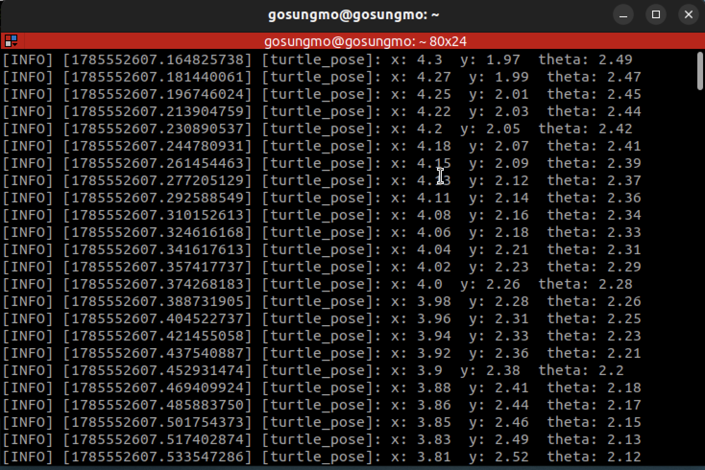
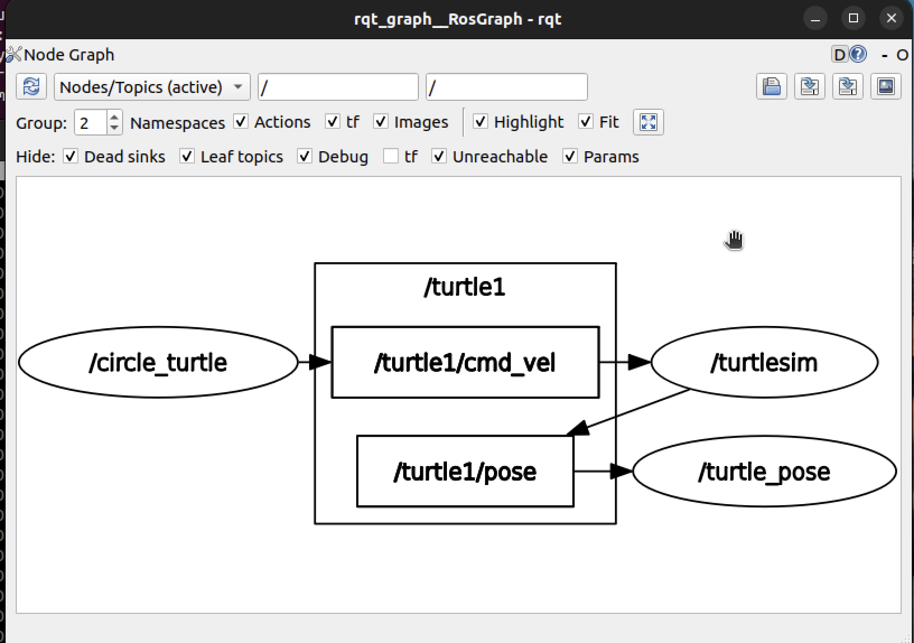

# 과정2 · 과제9 — 서브스크라이버(구독자) · 거북이의 상태를 읽는 노드

> **작성자** : SUNGMO  **작성일** : 2026-08-01
> **산출물** : 본 문서(`9_subscriber.md`) · 노드 소스(`turtle_pose.py`) · 실행 이미지(`9_pose_log.png` · `9_rqt_graph.png`) · 워크스페이스 압축(`9_ros2_ws.zip`)
> **실습 환경** : Apple Silicon Mac(M5 Pro) 위 UTM 가상머신 — **Ubuntu 22.04.5 LTS (arm64)** · bash 셸 · **ROS2 Humble** · 과제4~8의 `my_robot_controller` 패키지를 이어서 사용

---

## 0. 수행 목표

- **서브스크라이버에 대해서 알아보고 파이썬으로 서브스크라이버를 만들어본다.**

과제8에서는 내 노드가 거북이에게 **명령을 보내는**(게시) 쪽이었다. 이번에는 반대 방향 — 거북이가 알려주는 **자기 상태를 받아 읽는**(구독) 노드를 만든다. 이 둘을 갖추면 "명령을 보내고 결과를 확인하는" 로봇 제어의 순환 구조가 완성된다.

---

## 1. 파이썬으로 서브스크라이버 만드는 법

### 1-1. `create_subscription()`

```python
from turtlesim.msg import Pose                     # ① 받을 메시지 유형을 import

self.subscription = self.create_subscription(      # ② 구독자 생성
    Pose,                  # 메시지 유형
    '/turtle1/pose',       # 구독할 토픽 이름
    self.pose_callback,    # 메시지가 올 때마다 호출될 콜백 (괄호 없이!)
    10)                    # 큐 크기

def pose_callback(self, msg):                      # ③ 콜백 — 메시지를 인자로 받음
    self.get_logger().info(f'{msg.x}')
```

| 인자 | 의미 |
|------|------|
| 메시지 유형 | 게시자가 보내는 형과 **반드시 같아야** 한다 |
| 토픽 이름 | 게시자가 쓰는 이름과 **반드시 같아야** 한다 |
| 콜백 함수 | 도착 시 호출될 함수 — 과제6과 같이 **괄호 없이** 이름만 전달 |
| 큐 크기 | 아직 처리하지 못한 메시지를 몇 개까지 쌓아 둘지 (보통 10) |

### 1-2. 게시자와의 차이 — 무엇이 콜백을 부르는가

| | 게시자(과제8) | **구독자(이번 과제)** |
|---|---|---|
| 언제 일하나 | **내가 정한 주기**마다 (타이머 필요) | **메시지가 도착할 때마다** (타이머 불필요) |
| 콜백의 인자 | 없음 — `def timer_callback(self)` | **메시지 객체** — `def pose_callback(self, msg)` |
| 하는 일 | 메시지를 만들어 `publish()` | 받은 `msg` 의 필드를 읽어 처리 |

구독자는 **도착 자체가 트리거**이므로 타이머가 필요 없다. 다만 `rclpy.spin()` 은 여전히 필수다 — spin이 도는 동안에만 도착한 메시지를 꺼내 콜백을 호출하기 때문이다(과제6의 2-3).

---

## 2. turtlesim이 발행하는 토픽 — /turtle1/pose

### 2-1. 토픽 목록 확인

turtlesim_node 를 실행한 뒤 토픽 목록을 출력한다.

```
$ ros2 topic list
/parameter_events
/rosout
/turtle1/cmd_vel
/turtle1/color_sensor
/turtle1/pose
```

과제7~8에서 쓴 `/turtle1/cmd_vel` 은 turtlesim이 **구독**하는 토픽(명령을 받는 입구)이었다. 반대로 **`/turtle1/pose` 는 turtlesim이 게시하는 토픽**으로, 거북이가 지금 어디에 어떤 자세로 있는지를 스스로 알려주는 **출구**다.

```
[내 게시 노드] ──cmd_vel──▶ [turtlesim] ──pose──▶ [내 구독 노드]
                (명령 입구)               (상태 출구)
```

실제 로봇도 똑같다 — 모터에 명령을 내리는 토픽과, 엔코더·IMU로 측정한 현재 위치를 알리는 토픽이 따로 있다(과정1의 오도메트리).

### 2-2. 메시지 유형 확인

```
$ ros2 topic info /turtle1/pose
Type: turtlesim/msg/Pose
Publisher count: 1
Subscription count: 0
```

유형은 **`turtlesim/msg/Pose`** — std_msgs나 geometry_msgs가 아니라 **turtlesim 패키지가 자체 정의한 메시지**다. 게시자는 turtlesim 1개, 아직 구독자는 0개다(이제 우리가 만들 것이다).

---

## 3. `ros2 interface show` — 메시지의 속을 들여다보기

### 3-1. 명령의 역할

유형 이름(`turtlesim/msg/Pose`)만으로는 그 안에 어떤 값이 들어 있는지 알 수 없다. **`ros2 interface show <유형>`** 은 그 메시지·서비스·액션의 **정의(필드 구성)를 출력**해 주는 명령이다. 코드에서 `msg.x` 처럼 필드에 접근하려면 이름과 형을 정확히 알아야 하므로, **구독자를 만들기 전에 반드시 거치는 단계**다.

| 형제 명령 | 하는 일 |
|------|------|
| `ros2 interface show <유형>` | 해당 인터페이스의 필드 정의 출력 |
| `ros2 interface list` | 시스템에 설치된 모든 인터페이스 목록 |
| `ros2 interface package <패키지>` | 특정 패키지가 제공하는 인터페이스 목록 |
| `ros2 interface proto <유형>` | 모든 필드가 기본값으로 채워진 뼈대 출력 |

> **용어**
> - **인터페이스(interface)** : ROS2에서 노드끼리 주고받는 데이터의 **형식 약속**. 토픽용 메시지(msg), 서비스용(srv), 액션용(action)을 통틀어 부른다.

### 3-2. Pose 메시지의 구성

```
$ ros2 interface show turtlesim/msg/Pose
float32 x
float32 y
float32 theta

float32 linear_velocity
float32 angular_velocity
```

| 필드 | 의미 | 이번 과제에서 |
|------|------|------|
| `x` · `y` | 거북이의 **현재 위치** 좌표 (화면은 약 11×11 크기, 왼쪽 아래가 원점) | **기록 대상** |
| `theta` | 거북이가 **바라보는 방향** — 라디안 단위(0 = 오른쪽, π ≈ 3.14 = 왼쪽) | **기록 대상** |
| `linear_velocity` | 현재 **직진 속도** | 제외(속도) |
| `angular_velocity` | 현재 **회전 속도** | 제외(속도) |

정의 파일에서도 위치·방향 3개와 속도 2개가 빈 줄로 구분되어 있다. 흥미로운 점은 **과제8에서 우리가 Twist로 "보낸" 속도가, 여기서는 turtlesim이 "알려주는" 값으로 되돌아온다**는 것이다 — 명령과 상태 보고가 짝을 이루는 구조다.

---

## 4. `turtle_pose.py` 작성

### 4-1. 만들 동작

1. `/turtle1/pose` 토픽을 `turtlesim.msg` 모듈의 `Pose` 클래스로 구독한다.
2. 콜백에서 **속도를 제외한 나머지 정보(x·y·theta)** 를 다룬다.
3. 그 값이 **바뀔 때마다** 로그에 기록한다.
4. **Ctrl+C 로 종료할 때까지** 계속 구독한다.

**"값이 바뀔 때마다"를 구현하는 방법** : 노드 속성에 **직전 값을 기억**해 두고, 콜백에서 새 값과 비교해 다를 때만 기록한다. 이때 Pose는 **초당 60회 이상** 발행되고 float 값은 미세하게 계속 흔들리므로, 소수점 2자리로 **반올림해서 비교**해야 사람이 읽을 수 있는 로그가 된다. 그 결과 **거북이가 멈춰 있으면 로그도 멈추고, 움직일 때만 기록**되는 동작이 만들어진다.

### 4-2. 전체 코드

파일 위치 : `~/ros2_ws/src/my_robot_controller/my_robot_controller/turtle_pose.py`

```python
import rclpy
from rclpy.node import Node
from turtlesim.msg import Pose


class TurtlePose(Node):
    """/turtle1/pose 를 구독해 위치·방향(x·y·theta)이 바뀔 때마다 로그로 기록하는 노드."""

    def __init__(self):
        super().__init__('turtle_pose')
        self.subscription = self.create_subscription(   # 구독자 생성
            Pose,                  # 메시지 유형
            '/turtle1/pose',       # turtlesim_node 가 발행하는 토픽과 같은 이름
            self.pose_callback,    # 메시지가 도착할 때마다 호출될 콜백
            10)                    # 큐 크기
        self.last_pose = None      # 직전에 기록한 (x, y, theta)

    def pose_callback(self, msg):
        # 속도(linear_velocity·angular_velocity)를 제외한 위치·방향만 사용
        current = (round(msg.x, 2), round(msg.y, 2), round(msg.theta, 2))
        if current != self.last_pose:               # 값이 바뀐 경우에만 기록
            self.last_pose = current
            self.get_logger().info(
                f'x: {current[0]}  y: {current[1]}  theta: {current[2]}')


def main(args=None):
    rclpy.init(args=args)        # ① rclpy(통신 계층) 초기화
    node = TurtlePose()          # ② 노드 객체 생성 — 구독자가 이때 등록됨
    try:
        rclpy.spin(node)         # ③ Ctrl+C 까지 계속 구독 — 메시지 도착 시 콜백 호출
    except KeyboardInterrupt:    #    Ctrl+C 로 종료
        pass
    finally:
        node.destroy_node()      # ④ 노드 정리
        rclpy.try_shutdown()     # ⑤ rclpy 종료 (이미 종료됐으면 건너뜀)


if __name__ == '__main__':
    main()
```

- **토픽 이름은 게시자와 정확히 같아야** 한다 — `/turtle1/pose` (2-1에서 `ros2 topic list` 로 확인한 그대로).
- 콜백이 인자 `msg` 를 받는 점이 타이머 콜백(과제6)과 다르다 — 도착한 메시지가 그대로 전달된다.
- `rclpy.spin()` 이 Ctrl+C 까지 구독 상태를 유지한다(요구사항 4).

### 4-3. 의존성

`from turtlesim.msg import Pose` 로 turtlesim 패키지의 메시지를 사용하는데, 이 의존성은 **과제8에서 이미 `package.xml` 에 추가**해 두었다(`<depend>turtlesim</depend>`). 따라서 이번에는 추가 수정이 필요 없다.

---

## 5. 등록 · 빌드 · 실행

### 5-1. setup.py 에 진입점 추가

```python
    entry_points={
        'console_scripts': [
            'logging_node = my_robot_controller.logging:main',
            'timer_node = my_robot_controller.timer_test:main',
            'circle_turtle = my_robot_controller.circle_turtle:main',
            'turtle_pose = my_robot_controller.turtle_pose:main',
        ],
    },
```

### 5-2. 빌드와 동시 실행

```bash
cd ~/ros2_ws
colcon build --symlink-install      # 새 진입점 등록 → 재빌드 필요
source install/setup.bash
```

**과제8의 `circle_turtle` 과 함께** 터미널 3개로 실행한다. 세 노드는 각각 독립된 프로세스이므로, 서로 다른 터미널에서 `ros2 run` 으로 띄우면 자동으로 같은 ROS 그래프에 참여한다.

```bash
# 터미널 1 — 시뮬레이터
ros2 run turtlesim turtlesim_node

# 터미널 2 — 게시자(과제8) : 거북이를 원 운동시킴
ros2 run my_robot_controller circle_turtle

# 터미널 3 — 구독자(이번 과제) : 거북이의 좌표를 읽음
ros2 run my_robot_controller turtle_pose
```

### 5-3. 실행 결과

터미널 3에 거북이의 위치·방향이 변할 때마다 기록된다.

```
[INFO] [1785552607.164825738] [turtle_pose]: x: 4.3   y: 1.97  theta: 2.49
[INFO] [1785552607.181440061] [turtle_pose]: x: 4.27  y: 1.99  theta: 2.47
[INFO] [1785552607.196746024] [turtle_pose]: x: 4.25  y: 2.01  theta: 2.45
[INFO] [1785552607.213904759] [turtle_pose]: x: 4.22  y: 2.03  theta: 2.44
[INFO] [1785552607.230890537] [turtle_pose]: x: 4.2   y: 2.05  theta: 2.42
```



로그를 읽어 보면 **x 는 줄고 y 는 늘고 theta 는 줄어드는** 흐름이다 — 거북이가 원의 한 구간을 왼쪽 위 방향으로 돌고 있다는 뜻으로, circle_turtle 이 만든 원 운동이 좌표로 정확히 나타난다.

- circle_turtle 이 원을 그리게 하므로 **x·y 값이 원의 궤적을 따라 오르내리고**, theta 는 계속 증가하다 한 바퀴(2π)를 돌면 −π 쪽으로 넘어간다.
- **circle_turtle 을 Ctrl+C 로 끄면** 거북이가 멈추고, 값이 더 이상 변하지 않으므로 **turtle_pose 의 로그도 멈춘다** — "값이 바뀔 때마다"가 제대로 동작한다는 증거다.

---

## 6. rqt_graph 로 구조 확인

세 노드를 모두 실행한 상태에서 `rqt_graph` 를 **Nodes/Topics (active)** 모드로 확인한다.

> **주의 — 그래프는 "지금 실행 중인" 노드만 그린다**
> 처음 캡처했을 때 `/turtle_pose` 가 그래프에 없었다. 로그가 너무 빠르게 쌓여 잠시 노드를 꺼 둔 상태였기 때문이다. **Nodes/Topics (active)** 모드는 말 그대로 **활성 상태인 노드와 토픽만** 표시하므로, 그래프를 남기려면 **세 노드를 모두 켠 상태에서 리로드(↻)** 해야 한다.

```
[/circle_turtle] ──▶ [/turtle1/cmd_vel] ──▶ [/turtlesim] ──▶ [/turtle1/pose] ──▶ [/turtle_pose]
      (게시)                                   (구독·게시)                            (구독)
```

- 왼쪽 절반은 과제8의 구조(명령을 보내는 흐름), 오른쪽 절반이 이번에 추가된 구조(상태를 받는 흐름)다.
- 가운데 `/turtlesim` 은 **구독자이면서 동시에 게시자** — 명령을 받아 움직이고, 그 결과를 다시 알린다. 한 노드가 두 역할을 겸할 수 있음을 보여준다.
- 전체 흐름이 **명령 → 실행 → 상태 보고** 로 이어지는 로봇 제어의 기본 순환이다.



---

## 7. 결과 요약

| 항목 | 결과 |
|------|------|
| 서브스크라이버 작성법 | `create_subscription(형, 토픽, 콜백, 큐크기)` — 메시지 도착이 트리거, 콜백은 **msg 인자**를 받음 |
| 게시자와의 차이 | 게시자는 타이머로 주기 발행 / 구독자는 도착 시 자동 호출 (spin은 양쪽 모두 필수) |
| turtlesim의 토픽 | `/turtle1/cmd_vel`(구독=명령 입구) ↔ **`/turtle1/pose`(게시=상태 출구)** |
| /turtle1/pose | 유형 `turtlesim/msg/Pose`, 게시자 1(turtlesim) |
| ros2 interface show | 메시지·서비스·액션의 **필드 정의를 출력** — 코드 작성 전 필드 이름·형 확인용. list·package·proto 형제 명령 |
| Pose 구성 | `x`·`y`(위치) · `theta`(방향, 라디안) · `linear_velocity`·`angular_velocity`(속도) 총 5개 float32 |
| turtle_pose | 속도를 제외한 x·y·theta 를 직전 값과 비교해 **바뀔 때만** 기록, Ctrl+C 까지 구독 유지 |
| 동시 실행 | turtlesim + circle_turtle(게시) + turtle_pose(구독) 3개 노드 — 명령과 피드백의 순환 확인 |

**산출물**
- 문서 : `과정2/과제9/9_subscriber.md` (본 문서)
- 소스 : `과정2/과제9/turtle_pose.py`
- 이미지 : `9_pose_log.png`(구독 로그) · `9_rqt_graph.png`(노드·토픽 그래프)
- 압축 : `9_ros2_ws.zip` — 워크스페이스 디렉토리 압축(`src` 포함, `build/`·`install/`·`log/` 제외)

```bash
cd ~
zip -r 9_ros2_ws.zip ros2_ws -x "ros2_ws/build/*" "ros2_ws/install/*" "ros2_ws/log/*" "*__pycache__*"
```

---

## 8. 참고자료

**서브스크라이버 작성 (공식 튜토리얼 · API)**
- 파이썬 퍼블리셔·서브스크라이버 작성(create_subscription·콜백) : https://docs.ros.org/en/humble/Tutorials/Beginner-Client-Libraries/Writing-A-Simple-Py-Publisher-And-Subscriber.html
- rclpy Node API(create_subscription) : https://docs.ros2.org/foxy/api/rclpy/api/node.html
- 토픽 개념(게시-구독) : https://docs.ros.org/en/humble/Concepts/Basic/About-Topics.html

**인터페이스(메시지 구조) 확인**
- 인터페이스 개념(ros2 interface show) : https://docs.ros.org/en/humble/Concepts/Basic/About-Interfaces.html
- 토픽 이해(topic list·interface show 사용 예) : https://docs.ros.org/en/humble/Tutorials/Beginner-CLI-Tools/Understanding-ROS2-Topics/Understanding-ROS2-Topics.html
- turtlesim Pose 메시지 정의 : https://github.com/ros/ros_tutorials/blob/humble/turtlesim/msg/Pose.msg
- turtlesim 소스코드 : https://github.com/ros/ros_tutorials/tree/humble/turtlesim
